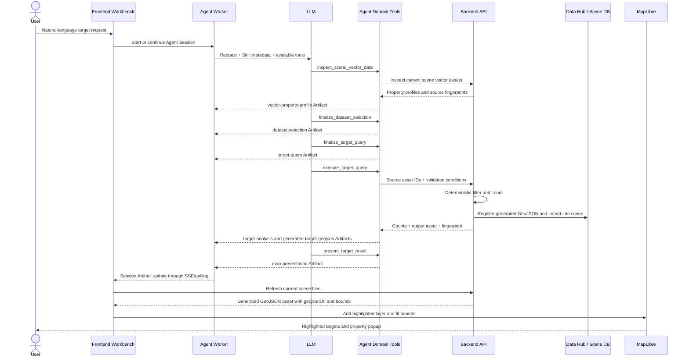

# Target Recognition End-to-End Coordination

This document explains how the frontend, Agent, and backend cooperate to turn
a natural-language spatial target request into an auditable analysis result
and an automatically highlighted map layer.

The target-recognition demo follows the project architecture:

```text
LLM decisions + Skill procedures + Workflow gates
+ deterministic Tools + Artifact audit
```

The key design rule is that the LLM decides what the user means, while the
backend decides which records actually match. The frontend never trusts a
natural-language answer as map data; it only renders a generated and registered
GeoJSON asset referenced by a `map-presentation` Artifact.

## Responsibilities

### Frontend

The frontend:

- sends the user's natural-language request to the current Agent Session;
- displays Agent activity, tool calls, messages, and confirmation requests;
- refreshes session metadata and Artifacts through SSE with polling fallback;
- detects the latest non-superseded `map-presentation` Artifact;
- resolves its `assetId` through the current scene file list;
- loads the generated GeoJSON into MapLibre;
- switches to Map or Split view, fits bounds, applies highlight styling, and
  shows feature properties in a popup.

The frontend does not interpret the user's target semantics and does not
recompute the target count.

Relevant modules:

- `frontend/pages/workbench/[sceneId].tsx`
- `frontend/pages/demo/target-recognition/[sceneId].tsx`
- `frontend/src/components/workbench/MapView.tsx`
- `frontend/src/lib/useAgentEventSource.ts`

### Agent

The Agent:

- uses the LLM to understand the target, time scope, and requested presentation;
- loads the `identify-spatial-targets` Skill as the investigation procedure;
- calls tools in an evidence-producing sequence;
- persists decisions and deterministic results as Artifacts;
- uses Workflow gates to prevent execution before required evidence exists;
- publishes a `map-presentation` Artifact after deterministic analysis succeeds.

The Agent does not filter GeoJSON itself and must not invent fields, matched
counts, asset IDs, or output geometry.

Relevant modules:

- `agent/skills/identify-spatial-targets/SKILL.md`
- `agent/src/tools/targetRecognitionTools.ts`
- `agent/src/workflowBoundary.ts`
- `agent/src/workflowToolGuards.ts`

### Backend

The backend:

- reads source GeoJSON metadata and property profiles;
- validates structured conditions against real fields and inferred types;
- deterministically evaluates all AND conditions;
- preserves matching Point features and splits matching MultiPoint features;
- calculates total, matched, and invalid feature counts;
- writes a deterministic result GeoJSON;
- registers the result in Data Hub and imports it into the current scene;
- returns the output asset metadata and SHA-256 fingerprint.

The backend does not infer that a phrase such as "high-risk waterlogging point"
means a particular field/value combination. That semantic mapping belongs to
the LLM, guided by the Skill and grounded by the property profile.

Relevant modules:

- `backend/app/target_recognition.py`
- `backend/app/routers/target_recognition.py`
- `backend/app/files_util.py`

## End-to-End Sequence



## Tool and Artifact Contract

### 1. Inspect scene data

Tool:

```text
inspect_scene_vector_data
```

Produces:

```text
vector-property-profile
```

The profile contains factual fields, inferred types, sampled values, numeric
ranges, geometry counts, and source fingerprints. It gives the LLM enough
evidence to propose a query without exposing every record from a large file.

### 2. Select datasets

Tool:

```text
finalize_dataset_selection
```

Produces:

```text
dataset-selection
```

The LLM interprets date semantics such as "latest" from evidence. The tool
validates that selected assets belong to the inspected scene candidates.
When time scope is missing or ambiguous, the Agent should ask the user instead
of silently selecting a dataset.

### 3. Finalize the structured query

Tool:

```text
finalize_target_query
```

Produces:

```text
target-query:<analysisContextId>
```

The query contains selected asset IDs, a human-readable target description,
and supported structured conditions. The tool rejects unknown fields,
incompatible values/operators, missing dataset selection, and unresolved
ambiguity.

The stable `analysisContextId` binds the query to:

```text
scene + source fingerprints + dataset selection + conditions + tool version
```

It prevents evidence from another scene, source version, or query from
satisfying the current workflow.

### 4. Execute deterministic analysis

Tool:

```text
execute_target_query({ analysisContextId })
```

Produces:

```text
target-analysis:<analysisContextId>
generated-target-geojson
```

The backend validates the query again, filters the source GeoJSON, writes the
result file, registers it in Data Hub, and imports it into the current scene.
The returned `outputAsset.id` is the authoritative bridge from analysis to map
presentation.

Repeated execution with the same context reuses current evidence and the same
deterministic output path.

### 5. Publish the map instruction

Tool:

```text
present_target_result({ analysisContextId })
```

Produces:

```text
map-presentation:<analysisContextId>
```

Example:

```json
{
  "sceneId": "scene-id",
  "analysisContextId": "context-id",
  "view": "split",
  "fitBounds": true,
  "title": "high-risk waterlogging points deeper than 30 cm",
  "layers": [
    {
      "assetId": "generated-result-asset-id",
      "role": "target-highlight",
      "visible": true,
      "style": {
        "circleColor": "#ef4444",
        "circleRadius": 8,
        "circleStrokeColor": "#991b1b"
      }
    }
  ]
}
```

This Artifact is a declarative UI instruction. It contains no GeoJSON payload;
the frontend resolves the registered asset through the scene file API.

## How the Frontend Applies the Result

The workbench refreshes Agent Session metadata and finds the latest
non-superseded `map-presentation` Artifact. For each requested layer it:

1. refreshes the current scene file list;
2. resolves the Artifact's `assetId`;
3. reads the asset's `geojsonUrl` and bounds;
4. creates a workbench vector layer with the declared role and style;
5. switches to Split or Map view;
6. increments `fitNonce` to request a bounds fit.

`MapView` then adds a MapLibre GeoJSON source and circle layer. A
`target-highlight` layer defaults to a red circle with a larger radius. Clicking
a point opens a popup containing all non-internal business properties.

## Persistence and Auditability

There are two complementary evidence stores:

- Agent Artifacts record reasoning inputs, structured decisions, analysis
  results, and presentation instructions.
- Data Hub and Scene records store the generated result GeoJSON as a normal
  reusable data asset.

For a successful request, developers should be able to trace:

```text
vector-property-profile
-> dataset-selection
-> target-query
-> target-analysis
-> generated result GeoJSON asset
-> map-presentation
```

The `matchedFeatureCount` in `target-analysis` must equal the number of Point
features in the generated result GeoJSON and the number of highlighted points
on the map.

## Failure Boundaries

Common failures and their owners:

| Symptom | Likely owner | Check |
| --- | --- | --- |
| LLM selects an unsupported field | Agent semantics/query planning | Property profile and `finalize_target_query` error |
| `Target query artifact not found` | Agent Artifact handoff | Stable `analysisContextId` and current Session Artifacts |
| Backend rejects source assets | Backend/scene data | Assets are imported into the requested scene and are GeoJSON |
| Database insertion fails | Backend/Data Hub persistence | Required `DataFile` fields are populated before `flush()` |
| Analysis succeeds but no map layer appears | Presentation/frontend | `map-presentation`, `outputAsset.id`, scene file refresh, `geojsonUrl` |
| Map layer appears but does not zoom | Frontend/map metadata | Result asset bounds and `fitBounds` |
| Highlight count differs from result count | Backend or frontend rendering | Result GeoJSON feature count versus `matchedFeatureCount` |

The Agent's no-progress protection should stop repeated failed calls, but the
preferred behavior is for each successful tool to return a stable Artifact and
an explicit `nextAction`.

## Manual Acceptance Test

1. Start the application:

   ```bash
   docker compose up -d --build
   ```

2. Create a new scene and import the three sample GeoJSON files from:

   ```text
   sample_data/target-recognition/
   ```

3. Open:

   ```text
   /demo/target-recognition/<scene-id>
   ```

4. Ask:

   ```text
   请统计最新一份数据中高风险且积水深度超过 30cm 的点，并在地图上高亮显示。
   ```

5. Confirm the activity sequence:

   ```text
   skill
   inspect_scene_vector_data
   finalize_dataset_selection
   finalize_target_query
   execute_target_query
   present_target_result
   finish
   ```

6. Confirm:

   - a `target-analysis` Artifact exists;
   - a generated result GeoJSON appears in Data Hub and the current scene;
   - a `map-presentation` Artifact references that result asset;
   - the frontend enters Split view and highlights the result points;
   - clicking a point displays its original business properties;
   - highlighted point count equals `matchedFeatureCount`.

## Extension Guidance

To add a new target-recognition use case, prefer expanding semantic guidance in
Skills and deterministic capabilities in domain tools. Do not add
business-specific phrase matching to `agent-core`, frontend components, or
generic workflow infrastructure.

When adding new map presentation types, extend the declarative
`map-presentation` contract first, then teach the frontend to render that
contract. Keep generated spatial data as registered scene assets so results
remain visible, reusable, and auditable outside the original Agent Session.
